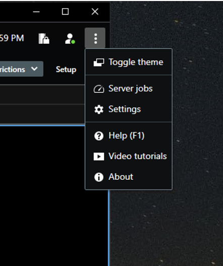
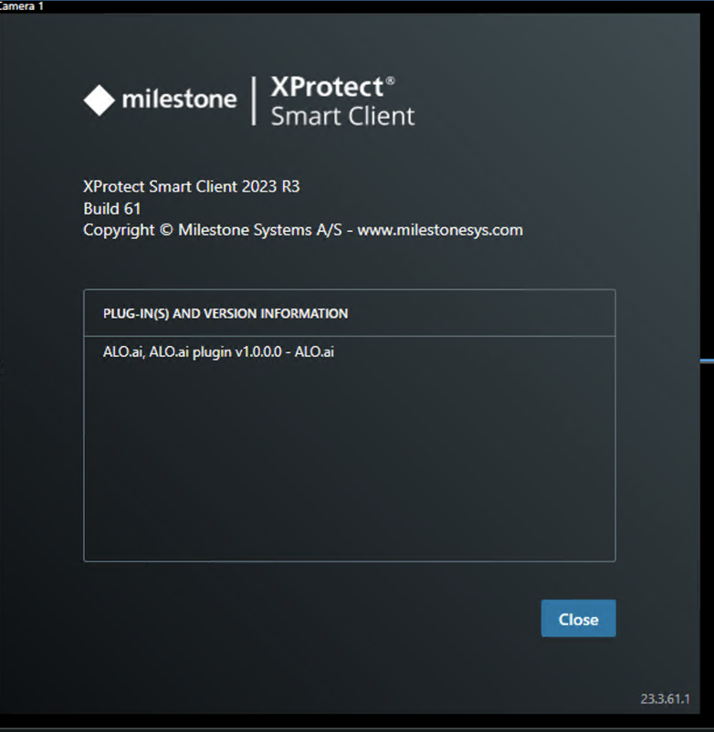

# ALO Milestone Integration Guide

## Introduction

This document provides instructions for integrating Milestone with ALO. It covers retrieving bookmarks from Milestone and sending them to the ALO.

## Installation

### Prerequisites

- **API key**: You need to contact ALO to obtain the API key, which will be configured by ALO to send the bookmarks to a specific team and channel.

### Installation Steps

1. During installation, you will be prompted for the API key and asked to choose whether to enable or disable automatic action creation at ALO.
2. You can modify these settings later by editing `appsettings.json` located at the installation location, for example:

`C:\Program Files\Milestone\XProtect Smart Client\MIPPlugins\AloAi.Milestone.Plugin\appsettings.json`

### The options are:

- **MinimumLevel**: The log level. Logs are grouped by date and stored at the installation location, in the logs folder, for example:

`C:\Program Files\Milestone\XProtect Smart Client\logs`

- **LookbackPeriod**: Search period for bookmarks (in minutes).

- **AutoActionCreation**: Auto creation of actions (true/false).

## How It Works?

The plugin exports bookmarks to: 

`C:\projects\alo-ai\plugin\AloAi.GenetecIntegration\AloAi.Milestone.Plugin`

Subsequently, it uploads them to ALO and deletes them from the disk.

## Upgrading

To upgrade:

1. Uninstall the current version.
2. Install the new version.

## Troubleshooting
The Milestone Smart Client requires a restart to load the ALO plugin. To verify that the plugin is loaded properly:

1. Open the options menu as shown in Screenshot 1.
2. Click on 'About'.
3. Ensure the plugin is listed as shown in Screenshot 2.

 
 

## Support

For assistance, contact:

success@alo.ai